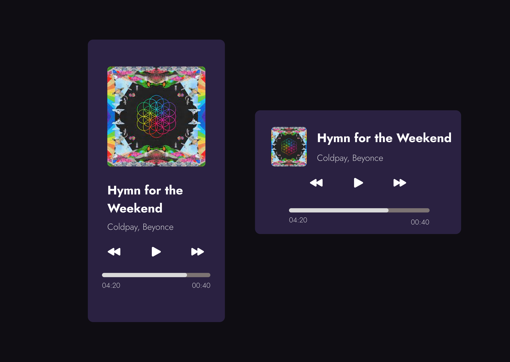
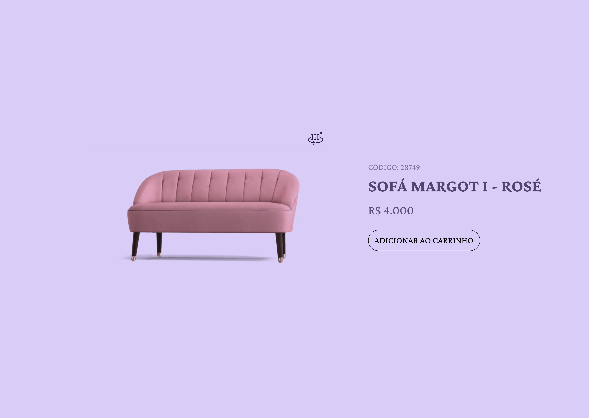
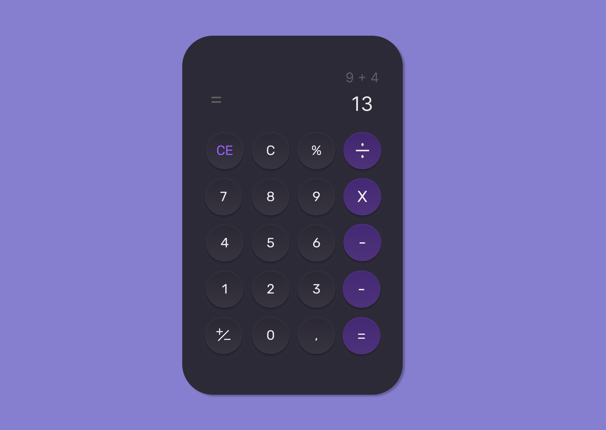
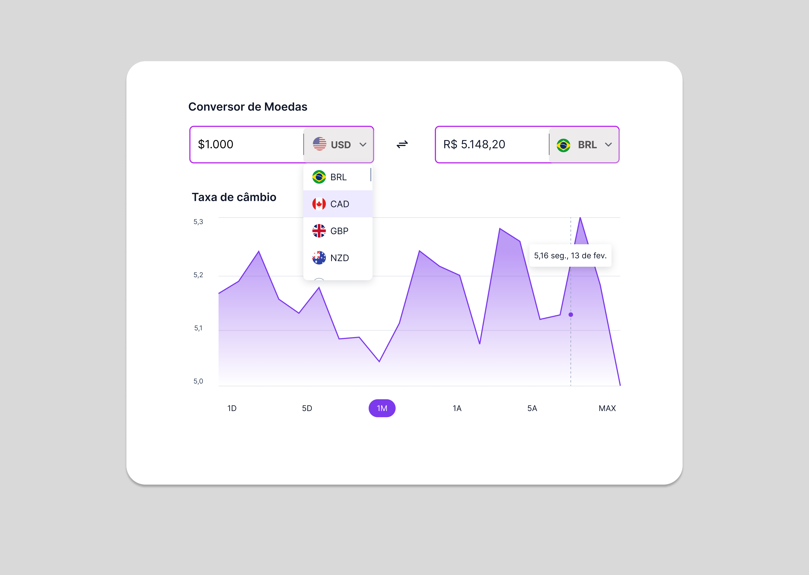

# #boraCodar

    Projetos #boraCodar da Rocketseat  
     <table>
    <thead>
        <tr>
            <th align="center">
                 
                

                    <small>#</small>
                

            </th>
            <th align="center">
                 
                
 
                    <small>
                        NOME
                    </small>
                

            </th>
            <th align="center">
                
                
 
                    <small>
                    PRE VISUALIZAÇÃO
                    </small>
                

            </th>
        </tr>
    </thead>
    <tbody>
        <tr>
            <td>01</td>
            <td><a href="https://github.com/raynnenogueira/boracodar/tree/main/playerdemusica">Player de Musica</a></td>
            <td align="center">
            </td>
        </tr>
        <tr>
            <td>02</td>
            <td><a href="https://github.com/raynnenogueira/boracodar/tree/main/cardproduto">Card de Produto</a></td>
            <td align="center">
            </td>
        </tr>
        <tr>
            <td>03</td>
            <td><a href="https://github.com/raynnenogueira/boracodar/tree/main/chat">Chat</a></td>
            <td align="center">
            </td>
        </tr>
        <tr>
            <td>04</td>
            <td><a href="https://github.com/raynnenogueira/boracodar/tree/main/calculadora">Calculadora</a></td>
            <td align="center">
            </td>
        </tr>
        <tr>
            <td>05</td>
            <td><a href="https://github.com/raynnenogueira/boracodar/tree/main/cartao-de-embarque">Cartão de embarque</a></td>
            <td align="center" >
            </td>
        </tr>
        <tr>
            <td>06</td>
            <td><a href="https://github.com/raynnenogueira/boracodar/tree/main/site-carnaval">Site para encontrar seu bloco no carnaval</a></td>
            <td align="center" >
            </td>
        </tr>
        <tr>
            <tr>
            <td>07</td>
            <td><a href="https://github.com/raynnenogueira/boracodar/tree/main/dashboard">Dashboard</a></td>
            <td align="center" >
            </td>
        </tr>
        <tr>
            <tr>
            <td>08</td>
            <td><a href="https://github.com/raynnenogueira/boracodar/tree/main/conversor-de-moedas">Conversor de Moedas</a></td>
            <td align="center" >
            </td>
        </tr>
    </tbody>
</table>
