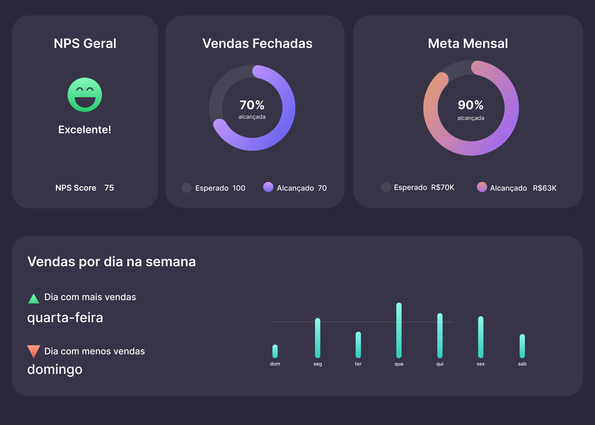

<h1 align="center"> Dashboard </h1>

Desafio feito junto com a Rockseat, junto com o @maykbrito
 
#boraCodar

 

<a href="https://raynnenogueira.github.io/boracodar/dashboard/" target="_blank">Visite aqui o projeto</a>

 

<h3 id="tecnologias"> Tecnologias Utilizadas</h3>

  
  

 

  

